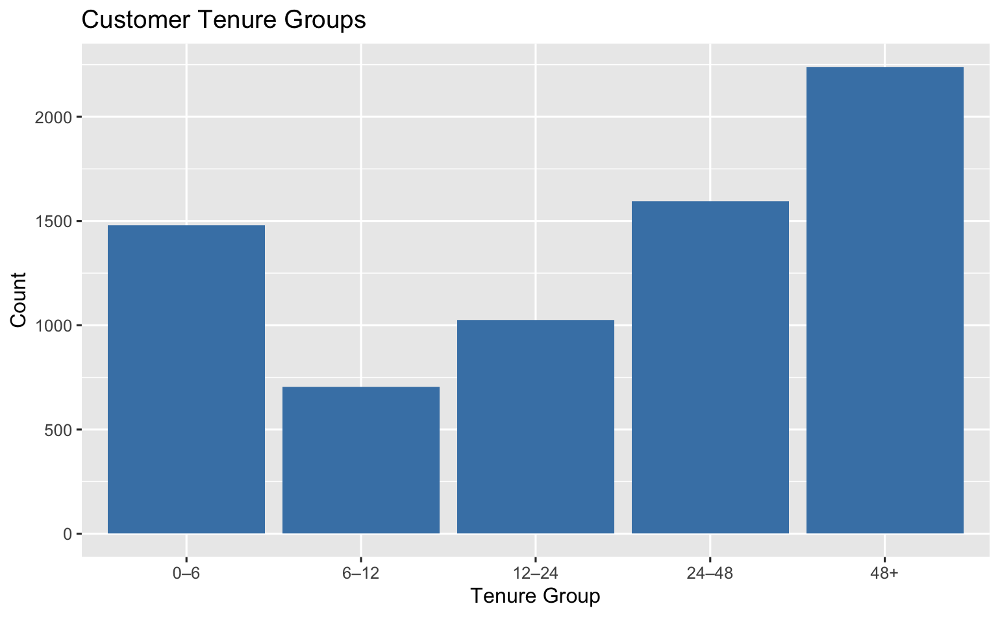

# Customer Churn Detection

Exploratory analysis of customer churn on the Telco churn dataset, built for **BSAN 750 — Group Assignment 2**. The project identifies which customer attributes — tenure, contract type, payment method, pricing, and demographics — are most associated with churn.

## Dataset

[`data/telco_churn.csv`](data/telco_churn.csv) — 7,043 customers, 21 columns.

| Category | Fields |
|---|---|
| Demographics | `gender`, `SeniorCitizen`, `Partner`, `Dependents` |
| Account | `tenure`, `Contract`, `PaperlessBilling`, `PaymentMethod` |
| Services | `PhoneService`, `MultipleLines`, `InternetService`, `OnlineSecurity`, `OnlineBackup`, `DeviceProtection`, `TechSupport`, `StreamingTV`, `StreamingMovies` |
| Billing | `MonthlyCharges`, `TotalCharges` |
| Target | `Churn` (Yes/No) |

**Data cleaning:** `TotalCharges` had 11 missing values, all belonging to customers who joined in the same month and had not yet been billed.

## Methodology

Analysis performed in R (`tidyverse`, `ggplot2`) — see [`notebooks/BSAN 750_Assign 2_Bank Churn_26th Nov.Rmd`](notebooks/BSAN%20750_Assign%202_Bank%20Churn_26th%20Nov.Rmd):

1. **Preparation** — categorical fields converted to factors, a binary `churn_ind` flag added, and customers bucketed into tenure groups (`0–6`, `6–12`, `12–24`, `24–48`, `48+` months) to see where churn concentrates.
2. **Univariate EDA** — distribution of tenure, monthly charges, and total charges.
3. **Bivariate EDA** — churn rate broken out by tenure group, contract type, payment method, monthly charges, internet service, and senior citizen status.
4. **Interaction effects** — churn by tenure group faceted on senior citizen status.

## Key Findings

- **Tenure is the strongest retention signal.** The largest customer segment (48+ months) churns the least; new customers (0–6 months, ~1,500 customers) are the highest-risk group.
- **Contract length drives loyalty.** Month-to-month customers churn far more than those on one- or two-year contracts.
- **Payment method matters.** Customers on automatic payments are the most stable; manual payment methods (electronic check, mailed check) show higher churn.
- **Pricing pressure.** Higher-paying customers churn more, suggesting a pricing/value mismatch for that segment.
- **Internet service type.** Fiber optic customers churn at a noticeably higher rate than DSL customers.
- **Billing distributions are right-skewed** — most customers cluster at lower tenure and lower total charges, with a long tail of high-value, long-tenure customers.

## Visualizations

**Customer tenure groups** — distribution of customers across tenure buckets, showing the large new-customer (0–6 month) and long-tenure (48+ month) segments.



**Churn by internet service & total charges** — churn rate split by internet service type (DSL vs. Fiber optic), alongside the spread of total charges for churned vs. retained customers.


## Repository Structure

```
customer-churn-ml-pipeline/
├── data/
│   └── telco_churn.csv                              # raw dataset
├── notebooks/
│   ├── BSAN 750_Assign 2_Bank Churn_26th Nov.Rmd     # R Markdown analysis notebook
│   ├── churn_distribution.png                        # tenure group distribution
│   └── Churn rate_service provider.png                # churn by internet service / total charges
└── README.md
```

## Requirements

- R with the `tidyverse` package installed
